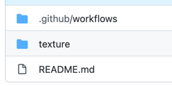
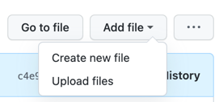
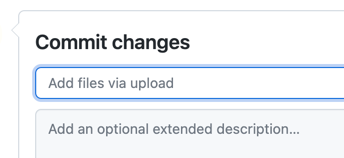
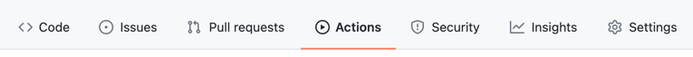
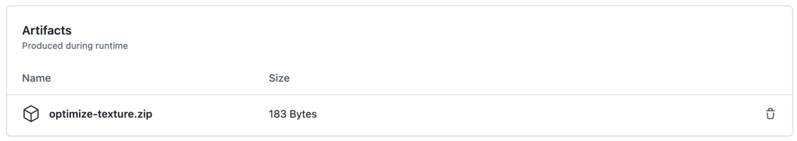
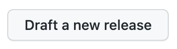
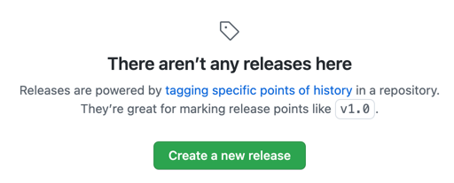
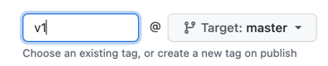
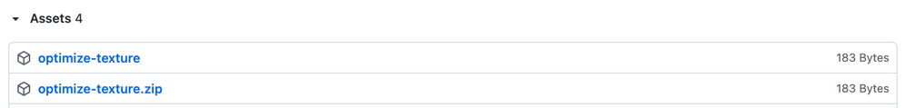

# action-PackSquash

## 使い方

### リソースパックのファイルを追加する

1. `texture` を開く。
   > 
2. `Add file` をクリックする。
   > 
3. `Upload files` を選択する。
4. ファイルを選択する(Choose your files)。
5. `Add files via uploaded` を変更の説明に置き換える(説明を書く)。
   > 
6. `Commit changes` をクリックする。
   > 

### 最適化されたリソースパックをダウンロードする

1. `Actions` をクリックする。
   > 
2. 最新のワークフローランを選択する。
3. Artifacts の下にある `optimize-texture.zip` をクリックする。
   > 
4. ダウンロードしたファイルを解凍する。

### 新バージョンをリリースする。

1. `Releases` をクリックする。
   > 
2. `Draft a new release` もしくは `Create a new release` をクリックする。
   > 
   > 
3. `Tag version` に `v1`, `v2` 等のバージョンを入力する。
   > 
4. `Publish release` をクリックする。
   > 
5. 少し経つとリリースからファイルをダウンロードできるようになる。
   > 
